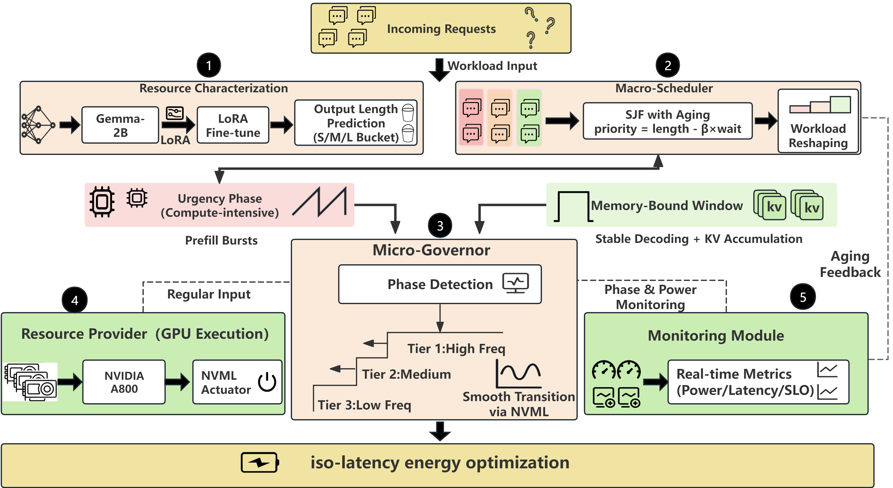

# EnergyServe: Energy-Efficient LLM Inference Serving via Resource Characterization to Achieve Optimal EDP

[](LICENSE)
[](https://www.python.org/downloads/release/python-390/)

This repository contains the official implementation of **EnergyServe**, a characterization-driven and cross-level framework for energy-efficient Large Language Model (LLM) serving. 

EnergyServe addresses the **phase interference** problem in continuous batching by aligning compute-intensive (prefill) and memory-intensive (decoding) phases to enable aggressive, fine-grained **Dynamic Voltage and Frequency Scaling (DVFS)**.


*Figure 3: The cross-level design of EnergyServe, comprising Perception, Macro-Scheduling, and Micro-Governance.*

## 🌟 Key Contributions

- **Phase Alignment**: We identify phase interference as the source of energy inefficiency and formulate the iso-latency optimization problem to achieve optimal **Energy-Delay Product (EDP)**.
- **Resource Characterization**: A lightweight perception model (Gemma-2B + LoRA) to predict request complexity and identify "deceptive short requests" (Short-Input Long-Output).
- **Macro-Scheduler**: A starvation-free **Shortest-Job-First (SJF)** policy that reshapes stochastic workloads into stable execution phases.
- **Micro-Governor**: A token-level power regulator that applies adaptive DVFS during memory-bound windows, achieving **27.2% energy reduction** and **31.6% EDP reduction** compared to vLLM.

## 📂 Project Structure

```text
EnergyServe/
├── assets/             # Architecture diagrams and result figures
├── configs/            # YAML configurations for training and serving
├── data/               # Training datasets and experimental workloads
├── energyserve/        # Core framework source code
│   ├── core/           # Async engine and request orchestration
│   ├── macro/          # Macro-Scheduler (SJF + Aging)
│   ├── micro/          # Micro-Governor (Adaptive DVFS)
│   └── utils/          # Analyzer, Logger, and Monitor tools
├── scripts/            # Entry scripts for the full pipeline
├── baselines/          # Implementation of 5 baseline methods
└── requirements.txt    # Environment dependencies
```

## 🚀 Getting Started

### 1. Installation
Ensure you have an NVIDIA GPU (Ampere architecture like A800/H800 recommended) and NVML installed.
```bash
pip install -r requirements.txt
```

### 2. Perception Model (Step-by-Step)
First, train and evaluate the resource characterization model:
```bash
# Train the predictor for a specific dataset
python scripts/train_predictor.py --dataset dolly

# Analyze the workload distribution (Generates Table 1)
python scripts/analyze_workload_distribution.py --dataset dolly

# Generate experiment workloads
python scripts/generate_workload.py --dataset dolly
```

### 3. Serving Experiments
Run the EnergyServe system or baselines (vLLM, Fixed-Power, Reactive-DVFS, FastServe, DynamoLLM):
```bash
# Run our proposed method
python scripts/run_serving.py --mode ours --dataset lmsys

# Run baselines
python scripts/run_baselines.py --mode dynamollm --dataset lmsys
```

## 📊 Experimental Results

EnergyServe achieves the optimal balance between performance (SLO) and energy efficiency.

### Table 2: End-to-End Performance (LMSYS-Chat-1M)
| System | Energy (J) | EDP (10^6) | Avg Latency (s) | SLO Attain. |
| :--- | :---: | :---: | :---: | :---: |
| vLLM (Base) | 52,418 | 3.48 | 66.36 | 86.70% |
| DynamoLLM | 44,230 | 3.05 | 68.99 | 86.45% |
| **EnergyServe** | **38,175** | **2.38** | **62.41** | **90.35%** |

### Visualization
Our framework provides automated plotting tools to generate figures from the paper:
```bash
python scripts/plot_paper_figs.py
```
- **Figure 7**: Real-time Power Profiles (Bimodal behavior).
- **Figure 5**: Multi-dimensional Performance Radar Chart.
- **Figure 6**: Latency Cumulative Distribution Function (CDF).


## 📜 Citation

If you find this work useful in your research, please consider citing the following (currently under review):

```bibtex
@article{energyserve2025,
  title={EnergyServe: Energy-Efficient LLM Inference Serving via Resource Characterization to Achieve Optimal EDP},
  author={Anonymous Authors},
  journal={Under Review},
  year={2025}
}
```
